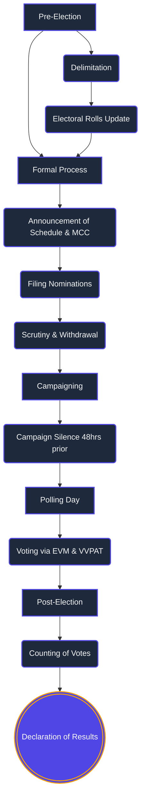
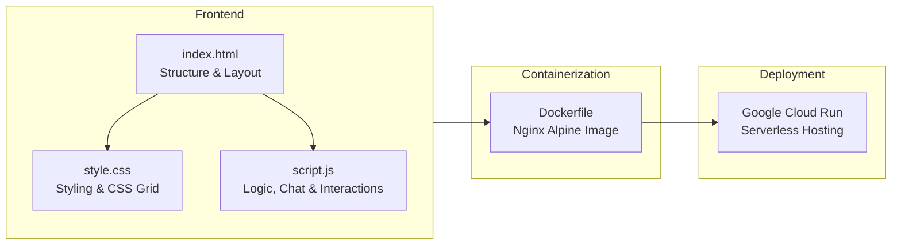

# 🇮🇳 Indian Election Assistant

An interactive and educational web application designed to help users understand the democratic process of the world's largest democracy. This project features a modern dashboard layout, interactive timelines, flashcards, a knowledge quiz, and an intelligent chat assistant.

**🌐 Live Demo:** [https://election-assistant-132832877560.us-central1.run.app](https://election-assistant-132832877560.us-central1.run.app)

---

## 🌟 Features

- **Interactive Timeline**: A step-by-step visual journey detailing the electoral process from Delimitation to Results.
- **Key Concepts (Flashcards)**: Flippable flashcards that define crucial election terminology like ECI, EVM, VVPAT, NOTA, and more.
- **Test Your Knowledge**: A built-in interactive quiz with immediate feedback to test your understanding of Indian elections.
- **Smart Chat Assistant**: An integrated chat widget that answers questions about the election process, current and past Prime Ministers, Presidents, and the role of Chief Ministers.

---

## 📊 Election Process Flow

Here is a high-level overview of the Indian Election Process as detailed in the application's timeline:



---

## 🏗️ Technical Architecture

The application is built using vanilla web technologies and containerized for seamless cloud deployment.



---

## 🚀 Running Locally

You can run this project locally without any complex installations.

### Method 1: Direct File Open (Easiest)
Simply download or clone this repository and double-click `index.html` to open it in your preferred web browser.

### Method 2: Local Web Server
If you are using VS Code, you can use the **Live Server** extension:
1. Open the project folder in VS Code.
2. Right-click on `index.html`.
3. Select **"Open with Live Server"**.

### Method 3: Using Docker
If you have Docker installed, you can build and run the container locally:
```bash
docker build -t election-assistant .
docker run -p 8080:80 election-assistant
```
Then visit `http://localhost:8080` in your browser.
